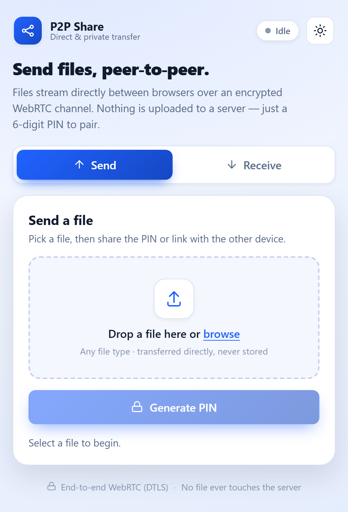
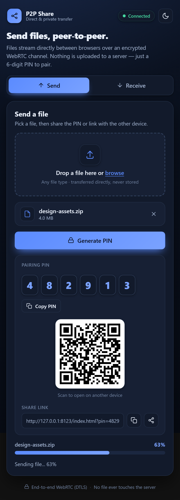
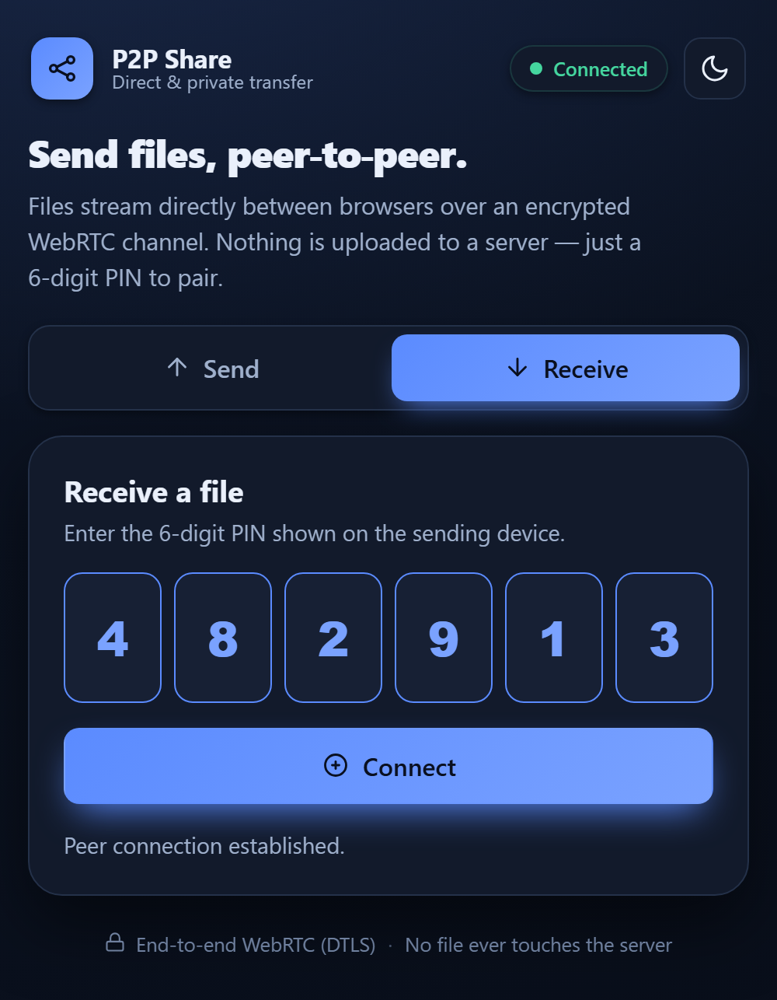
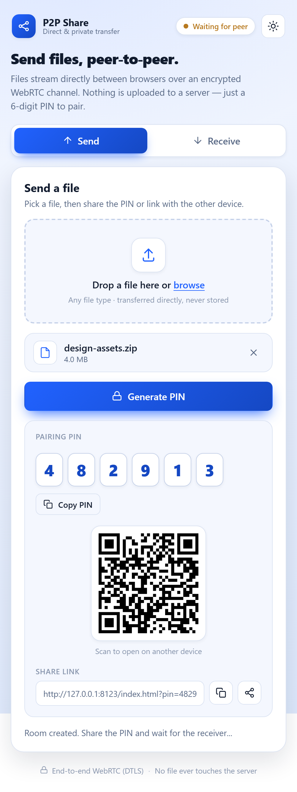
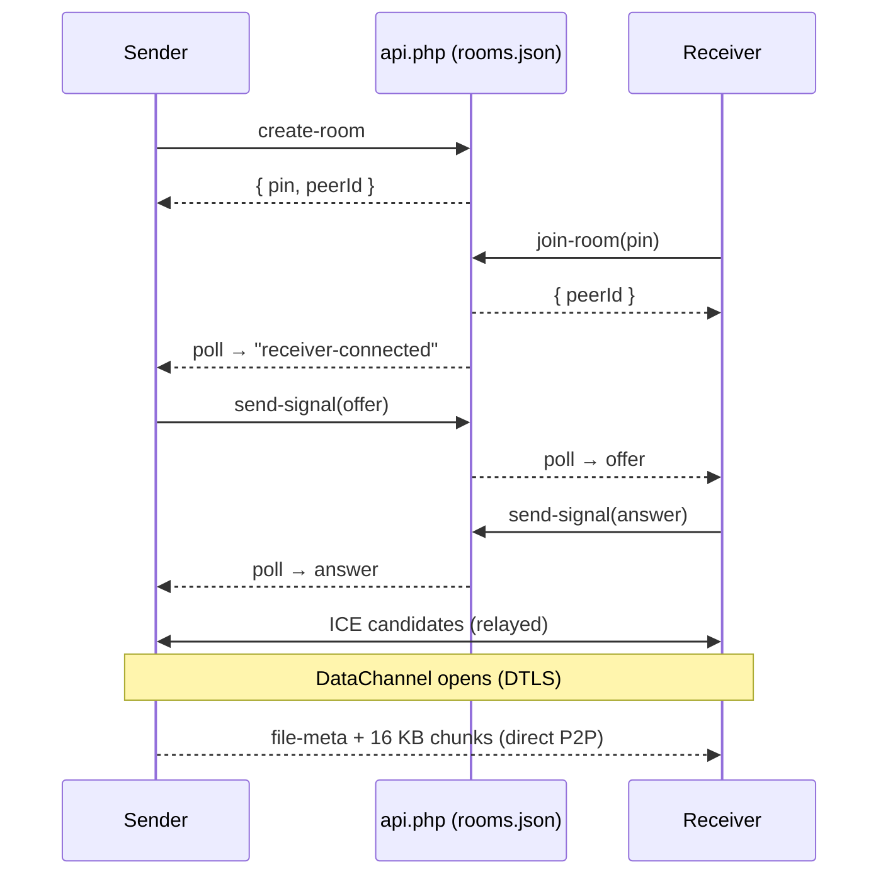

# P2P Share

**P2P Share** is a browser-to-browser file transfer app. Files stream **directly between two browsers** over an encrypted WebRTC DataChannel — they never pass through a server. Pairing is done with a simple **6-digit PIN**, a **QR code**, or a **share link**.

The PHP backend is used *only* for signaling (`offer`, `answer`, `ice-candidate`) over HTTPS. It never sees or stores file data.

---

## Screenshots

| Send | Share (paired + transferring) |
| :---: | :---: |
|  |  |

| Receive (PIN entry) | Light / dark themes |
| :---: | :---: |
|  |  |

---

## Features

- **6-digit PIN** room pairing
- Modern **tabbed UI** (Send / Receive) with **light & dark themes** (auto + manual toggle)
- **Drag-and-drop** file picker (keyboard-operable)
- Scannable **QR code** + shareable **`?pin=` deep link** + native **Web Share** sheet
- **Segmented 6-box PIN entry** with auto-advance, paste, and deep-link auto-fill
- Live **progress bars**, a **connection-status pill**, and **toast notifications**
- Chunked transfer (16 KB chunks) over a **WebRTC DataChannel** (DTLS-encrypted)
- HTTPS signaling API in PHP — **no database** (file-based room state)
- Installable **PWA** with app shortcuts; works offline for the app shell
- **Zero build step** — plain HTML/CSS/JS

---

## How It Works

```
   Sender browser                    PHP signaling (api.php)                 Receiver browser
   --------------                    -----------------------                 ----------------
        │  create-room  ───────────────────►  rooms.json  │                           │
        │  ◄─────────────── { pin, peerId }               │                           │
        │                                                 │  ◄──── join-room (pin) ────│
        │  ◄──── poll: "receiver-connected" ──────────────│  ───── { peerId } ────────►│
        │                                                 │                           │
        │  offer ────────►│ queue │────────── poll ──────────────────────────────────►│
        │◄───────────────────────────────── poll ◄──────│ queue │◄──────── answer ────│
        │  ice-candidate ⇄  (relayed via queues both directions)  ⇄  ice-candidate     │
        │                                                                             │
        │  ═══════════  WebRTC DataChannel (DTLS, peer-to-peer)  ═══════════════════  │
        │  file-meta {name,size} ──► then 16 KB binary chunks ──────────────────────► │
        │                                                        auto-download on done │
```

- **Signaling** (control plane): a tiny PHP JSON API relays SDP offers/answers and ICE
  candidates between the two peers using per-room message queues. Peers discover messages by
  **polling** every ~900 ms.
- **Transfer** (data plane): once the DataChannel opens, the file is read, framed with a JSON
  `file-meta` header, and sent as 16 KB `ArrayBuffer` chunks. **No bytes touch the server.**

### Pairing sequence



---

## Tech Stack

| Layer | Technology |
| --- | --- |
| Frontend | HTML, CSS, Vanilla JavaScript (no build step) |
| P2P transport | WebRTC — `RTCPeerConnection`, `RTCDataChannel` |
| Signaling | PHP 8+ JSON API (`fetch` polling) |
| NAT traversal | STUN — `stun:stun.l.google.com:19302` |
| QR codes | vendored [`qrcode-generator`](https://github.com/kazuhikoarase/qrcode-generator) (MIT), served locally for offline use & privacy — [`public/vendor/qrcode.js`](public/vendor/qrcode.js) |
| PWA | `manifest.webmanifest` + service worker (`sw.js`) |

---

## Project Structure

```text
/project-root
  .gitignore
  /server
    composer.json
    signaling-server.php        # legacy WebSocket server (not used by current HTTPS mode)
    /storage
      rooms.json                # auto-created signaling state (keep OUT of web root)
  /public                       # <-- web root / document root
    .htaccess                   # HTTP→HTTPS redirect + manifest mime (Apache)
    api.php                     # signaling API (POST only)
    app.js                      # client: UI + WebRTC engine
    index.html
    style.css                   # design system + light/dark themes
    manifest.webmanifest
    sw.js                       # service worker (cache name: p2p-share-v2)
    /icons
    /vendor
      qrcode.js                 # vendored MIT QR generator
  /docs
    /screenshots                # images embedded in this README
  README.md
```

---

## System Requirements

**Server (hosting the signaling API + static files)**

| Requirement | Details |
| --- | --- |
| PHP | **8.0+** (CLI for local dev; PHP-FPM/mod_php for production). Tested on PHP 8.5. |
| PHP extensions | `json` (bundled). No database, no Composer packages required for the HTTPS mode. |
| Web server | PHP built-in server (dev only), or Apache / nginx / Caddy / LiteSpeed (production). |
| Writable path | `server/storage/` must be writable by the PHP process (auto-created; holds `rooms.json`). |
| TLS | A valid HTTPS certificate for any public hostname (required — see below). |
| Resources | Minimal: signaling is tiny JSON; file bytes never touch the server. ~128 MB RAM is plenty. |
| Optional | A **TURN** server (e.g. coturn) for peers on different/strict NATs. |

**Client (end users)**

- A modern browser with WebRTC: Chrome/Edge 80+, Firefox 75+, Safari 13.1+ (desktop or mobile).
- The page must be served from a **secure context** (`https://` or `localhost`).

> **No build step, no npm.** The app is plain HTML/CSS/JS served by PHP — there is nothing to
> compile or install. The only vendored file, [`public/vendor/qrcode.js`](public/vendor/qrcode.js),
> is a static script loaded directly by the browser.

---

## Run Locally

From the project root:

```bash
php -S localhost:8000 -t public
```

Open:

```text
http://localhost:8000/index.html
```

`localhost` counts as a secure context, so WebRTC works without HTTPS for local testing.

From the project root:

```bash
php -S localhost:8000 -t public
```

Open:

```text
http://localhost:8000/index.html
```

`localhost` counts as a secure context, so WebRTC works without HTTPS for local testing.

---

## HTTPS Requirement

WebRTC (and the service worker) require a **secure context**. The app enforces this in
[`app.js`](public/app.js) via `isHttpsAllowed()`:

- `https://…` → allowed (normal usage)
- `http://localhost` / `127.0.0.1` / `::1` → allowed (local dev)
- any other `http://…` (e.g. a LAN IP) → **blocked** — the page loads but **Generate PIN /
  Connect are disabled**

The included [`public/.htaccess`](public/.htaccess) redirects HTTP → HTTPS on Apache.

---

## Accessing From Another PC

Because of the HTTPS requirement above, plain `http://<lan-ip>:8000` will load the page but
**won't transfer**. The PHP built-in server cannot serve HTTPS, so use one of these:

### Option A — HTTPS tunnel (easiest, works across any network)

```powershell
winget install --id Cloudflare.cloudflared

# terminal 1 — run the app
php -S localhost:8000 -t public

# terminal 2 — expose it over HTTPS
cloudflared tunnel --url http://localhost:8000
```

Open the printed `https://<random>.trycloudflare.com` URL on **both** devices. (`ngrok http 8000`
works equivalently.)

### Option B — Same LAN with local HTTPS (Caddy)

Serve `public/` with [Caddy](https://caddyserver.com/) (it provides TLS). Note the other device
must trust Caddy's local CA, or click through the browser warning.

### Option C — Reach the page over plain HTTP (page only, no transfer)

```powershell
php -S 0.0.0.0:8000 -t public     # bind all interfaces
ipconfig                           # find your IPv4, e.g. 192.168.1.50
# allow the port (run PowerShell as Administrator):
New-NetFirewallRule -DisplayName "P2PShare 8000" -Direction Inbound -LocalPort 8000 -Protocol TCP -Action Allow
```

> **NAT note:** peers on the *same* network connect fine with the STUN-only config. Peers on
> *different* networks may need a **TURN** server — add one to `RTC_CONFIG` in
> [`app.js`](public/app.js).

---

## Hosting & Deployment

The app is **static files + one PHP endpoint**, so it runs on almost any PHP host. The golden
rules:

1. Serve the **`public/`** directory as the web root (document root).
2. Keep **`server/`** *outside* the web root so `rooms.json` is never web-accessible.
3. Make **`server/storage/`** writable by the PHP process.
4. Serve everything over **HTTPS** (WebRTC requires it off-localhost).

Recommended layout on the server:

```text
/var/www/p2pshare/
  server/            # NOT web-accessible  (storage/rooms.json lives here)
  public/            # <-- document root points here
```

> `api.php` resolves storage as `dirname(__DIR__)/server/storage/rooms.json`, i.e. one level
> above `public/`. Keep that `public/` ↔ `server/` sibling relationship intact.

### Option 1 — Caddy (simplest, automatic HTTPS)

Caddy obtains and renews Let's Encrypt certs automatically. `Caddyfile`:

```caddy
share.example.com {
    root * /var/www/p2pshare/public
    encode gzip
    php_fastcgi unix//run/php/php-fpm.sock
    file_server
}
```

```bash
caddy run --config Caddyfile     # or: caddy start
```

Point `share.example.com`'s DNS at the server first; Caddy handles TLS on first request.

### Option 2 — Nginx + PHP-FPM

```nginx
server {
    listen 443 ssl http2;
    server_name share.example.com;

    ssl_certificate     /etc/letsencrypt/live/share.example.com/fullchain.pem;
    ssl_certificate_key /etc/letsencrypt/live/share.example.com/privkey.pem;

    root /var/www/p2pshare/public;
    index index.html;

    # Static files, then fall back to index.html
    location / {
        try_files $uri $uri/ /index.html;
    }

    # The signaling endpoint
    location = /api.php {
        include fastcgi_params;
        fastcgi_pass unix:/run/php/php8.3-fpm.sock;
        fastcgi_param SCRIPT_FILENAME $document_root/api.php;
    }

    # Correct MIME type for the PWA manifest
    types { application/manifest+json webmanifest; }

    # Belt-and-suspenders: never serve the signaling state
    location ~ /\.(?!well-known) { deny all; }
}

# Redirect HTTP → HTTPS
server {
    listen 80;
    server_name share.example.com;
    return 301 https://$host$request_uri;
}
```

Get a certificate with Certbot:

```bash
sudo certbot --nginx -d share.example.com
```

### Option 3 — Apache (incl. shared hosting / cPanel)

Apache works out of the box with the bundled [`.htaccess`](public/.htaccess) (HTTP→HTTPS redirect
+ manifest MIME). Requirements:

- `mod_rewrite` enabled (for the HTTPS redirect).
- `php` enabled (mod_php or PHP-FPM via your host's panel), version 8.0+.
- `AllowOverride All` for the directory so `.htaccess` is honored.

**Dedicated/VPS vhost:**

```apache
<VirtualHost *:443>
    ServerName share.example.com
    DocumentRoot /var/www/p2pshare/public

    SSLEngine on
    SSLCertificateFile    /etc/letsencrypt/live/share.example.com/fullchain.pem
    SSLCertificateKeyFile /etc/letsencrypt/live/share.example.com/privkey.pem

    <Directory /var/www/p2pshare/public>
        AllowOverride All
        Require all granted
    </Directory>
</VirtualHost>
```

**Shared hosting / cPanel (no shell vhost control):**

1. Upload the project so that `public/` maps to your site's web root — either:
   - set the domain's **Document Root** to `.../p2pshare/public` in the panel, **or**
   - put the contents of `public/` into `public_html/` and upload the `server/` folder *beside*
     `public_html` (one level up), preserving the `../server/storage` path.
2. Ensure `server/storage/` is writable (the panel's File Manager → Permissions, `0775`).
3. Enable HTTPS (most panels offer free AutoSSL / Let's Encrypt).

### Behind a reverse proxy / load balancer / CDN

If TLS is terminated upstream (Cloudflare, an ALB, nginx proxy), make sure the
`X-Forwarded-Proto: https` header is forwarded. The bundled `.htaccess` already checks it to avoid
redirect loops. For PWAs, let the origin control cache headers for `sw.js` (don't let a CDN cache
the service worker aggressively).

### Set permissions (Linux)

```bash
sudo chown -R www-data:www-data /var/www/p2pshare/server
sudo chmod -R 0775 /var/www/p2pshare/server/storage
```

### TURN for production NAT traversal

STUN alone fails for symmetric NATs (common on mobile/carrier networks). Run
[coturn](https://github.com/coturn/coturn) and add it to `RTC_CONFIG` in
[`app.js`](public/app.js):

```js
const RTC_CONFIG = {
  iceServers: [
    { urls: "stun:stun.l.google.com:19302" },
    {
      urls: ["turn:turn.example.com:3478?transport=udp", "turns:turn.example.com:5349"],
      username: "p2p",
      credential: "REPLACE_WITH_SECRET",
    },
  ],
};
```

> Use short-lived TURN credentials (coturn's `use-auth-secret` / time-limited HMAC) in production
> rather than a static password.

### Post-deploy checklist

- [ ] `https://your-host/index.html` loads and the status pill reads **Idle** (no HTTPS warning).
- [ ] `server/storage/rooms.json` is created after the first **Generate PIN** (and is **not**
      reachable at `https://your-host/../server/...`).
- [ ] Two devices can pair and transfer (test same-network first, then across networks).
- [ ] `manifest.webmanifest` is served as `application/manifest+json` and the app is installable.
- [ ] Hard-refresh works after redeploys (service-worker cache name is versioned).

---

## How to Use

1. Open the app on two browsers/devices.
2. **Sender** (Send tab):
   - Drag a file onto the drop zone (or click to browse).
   - Click **Generate PIN**.
   - Share the PIN, let the other device **scan the QR**, or send the **`?pin=` link**.
3. **Receiver** (Receive tab):
   - Enter the 6-digit PIN — or open the shared link / scan the QR to auto-fill and auto-connect.
   - Click **Connect**.
4. Transfer starts automatically once the DataChannel connects.
5. The receiver's download triggers automatically on completion; a **Save again** button is also shown.

---

## Configuration

| Setting | Location | Default |
| --- | --- | --- |
| STUN / TURN servers | `RTC_CONFIG` in [`app.js`](public/app.js) | Google STUN only |
| Chunk size | `CHUNK_SIZE` in [`app.js`](public/app.js) | 16 KB |
| Poll interval | `POLL_INTERVAL_MS` in [`app.js`](public/app.js) | 900 ms |
| Stale peer timeout | `STALE_PEER_SECONDS` in [`api.php`](public/api.php) | 90 s |
| Idle room timeout | `ROOM_IDLE_SECONDS` in [`api.php`](public/api.php) | 900 s |
| Max queued signals/room | `MAX_QUEUE_SIZE` in [`api.php`](public/api.php) | 400 |

---

## Signaling API (internal)

Endpoint: `POST public/api.php` — JSON body, JSON response of shape `{ ok: boolean, ... }`.

| Action | Body | Returns |
| --- | --- | --- |
| `create-room` | `{ action }` | `{ pin, peerId }` |
| `join-room` | `{ action, pin }` | `{ peerId }` |
| `send-signal` | `{ action, pin, peerId, type, payload }` | `{}` — `type` ∈ `offer`/`answer`/`ice-candidate` |
| `poll` | `{ action, pin, peerId }` | `{ messages: [...] }` (and drains the peer's queue) |
| `leave` | `{ action, pin, peerId }` | `{}` |

- State lives in `server/storage/rooms.json` (auto-created), guarded by an exclusive file lock.
- A room holds exactly **one sender + one receiver**; a second `join-room` is rejected.

---

## Concurrency & Limits

- **File transfers are peer-to-peer**, so the server's bandwidth/disk is *not* a bottleneck —
  concurrency is bounded by the **signaling layer**, not the data.
- Every signaling request takes a **global exclusive lock** on `rooms.json` and rewrites the whole
  file, and all peers **poll every 900 ms for the full duration** of a transfer. This serializes
  work and scales ~O(N²) with active rooms.

| Deployment | Realistic simultaneous transfers |
| --- | --- |
| `php -S` dev server (single-threaded) | ~2–5 |
| Apache / nginx + php-fpm | ~tens (≈20–50) before pairing gets laggy |
| PIN space (hard ceiling) | 1,000,000 six-digit PINs |

**To scale further:** stop polling once connected, switch to per-room storage (or Redis) to drop
the global lock, move to WebSocket signaling (see `server/signaling-server.php`), and add TURN.

---

## Security & Privacy

- File bytes travel **only** over the WebRTC DataChannel, which is **DTLS-encrypted** end-to-end.
- The server never receives, buffers, or stores file contents — it relays SDP/ICE only.
- Peer IDs are random 128-bit tokens; signaling actions are authorized against them
  (`hash_equals`).
- Rooms and queues auto-expire (stale peers and idle rooms are cleaned up on each request).
- The QR library is vendored locally, so the pairing PIN/link is **never sent to a third party**.

---

## Install as App (PWA)

On Chrome/Edge (desktop or Android):

1. Open the app over `https://`.
2. Wait a few seconds for the service worker and manifest to load.
3. Install:
   - **Android Chrome:** *Add to Home screen* / *Install app*
   - **Desktop Chrome/Edge:** the install icon in the address bar, or menu → *Install P2P Share*

The manifest defines **Send** and **Receive** app shortcuts.

---

## Accessibility & UX

- Respects `prefers-color-scheme`; the manual theme choice is persisted in `localStorage` and
  applied before first paint (no flash).
- Honors `prefers-reduced-motion`.
- Keyboard-operable drop zone, PIN entry, and tabs, with visible focus rings.
- `aria-live` status and toast regions for screen readers; safe-area insets for notched devices.

---

## Development

The app has **no build step and no package manager** — edit the files in `public/` and refresh the
browser. That's the entire workflow.

---

## Troubleshooting

### `Generate PIN` / `Connect` do nothing on another device
You're on plain HTTP. WebRTC needs HTTPS off-localhost — see
[Accessing From Another PC](#accessing-from-another-pc).

### `api.php` returns 405 in the browser
Expected — `api.php` only accepts `POST`.

### Connection fails between peers
- Ensure both peers use HTTPS (or localhost).
- Check the browser console for ICE/WebRTC errors.
- Strict/symmetric NATs (different networks) may require a **TURN** server.

### Stale UI after deploying a new version
Hard-refresh (`Ctrl/Cmd+F5`). The service worker cache name is bumped (`p2p-share-v2`) so a reload
picks up new assets.

---

## Notes

- `server/signaling-server.php` is a legacy WebSocket signaling server and is **not** required by
  the current HTTPS polling mode.
- No external runtime dependencies; the only vendored file is the MIT QR generator.
